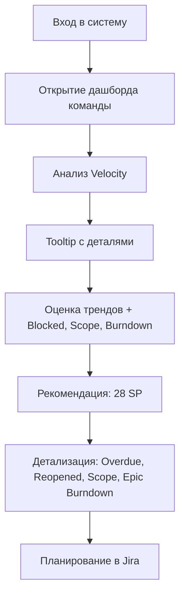

# UX User Flow: Персона 2 — Менеджер (Scrum) [обновлено]

## 🎯 Цель сценария
Спланировать оптимальную нагрузку на предстоящий спринт на основе анализа фактической скорости команды (Velocity), стабильности выполнения задач и общего состояния команды.

## 🧑‍💼 Контекст
- Команда работает по Scrum.
- Спринты двухнедельные, планирование в Story Points.
- Используется дашборд Design Flow с визуальными метриками.

---

## 🔄 Шаги пользовательского сценария

### 1. Вход в систему Design Flow  
Менеджер авторизуется и переходит на главную страницу.

### 2. Открытие дашборда команды  
Выбор команды из списка.  
→ Загружается сводный дашборд Scrum-команды с виджетами.

### 3. Анализ производительности по Velocity  
Менеджер смотрит на виджет **Velocity: Committed vs Completed**, где видно:
- SP по последним 6 спринтам;
- линию тренда Velocity (rolling avg);
- Predictability.

### 4. Tooltip на графике Velocity  
При наведении появляется детализированная подсказка:
```
Sprint: FDS SP#42
Period: 15.02.25–25.02.25
Committed: 36 SP
Completed: 43 SP
Velocity avg: 30.6
Predictability: 78.8
```

### 5. Интерпретация рисков  
Менеджер:
- Сравнивает тренды;
- При необходимости сверяется с **Blocked Time** — сколько задач были заблокированы;
- Анализирует **Sprint Burndown**, чтобы понять, был ли равномерный прогресс;
- Смотрит **Scope Change** (увеличение/уменьшение объема задач).

### 6. Получение рекомендации по нагрузке  
Система автоматически рассчитывает на основе Velocity:
> "Рекомендуемая загрузка на следующий спринт: **28 SP**"

### 7. Переход к деталям задач  
Менеджер открывает задачи, не завершённые в предыдущем спринте или созданные после старта.  
Смотрит на:
- **Overdue Tasks**
- **Reopened Designs**
- **Issues Created after Sprint Start**
- **Epic Burndown** — чтобы отследить движение по ключевым инициативам.

### 8. Подготовка к планированию  
Полученные данные передаются в планирование Jira или обсуждаются на синке.

---

## 📈 Диаграмма флоу (Mermaid)



---

## 🧭 Используемые метрики и виджеты

- Velocity
- Predictability / Commitment Rate
- Sprint Burndown
- Blocked Time
- Scope Change
- Overdue Tasks
- Reopened Designs
- Epic Burndown
- Issues Created after Sprint Start

